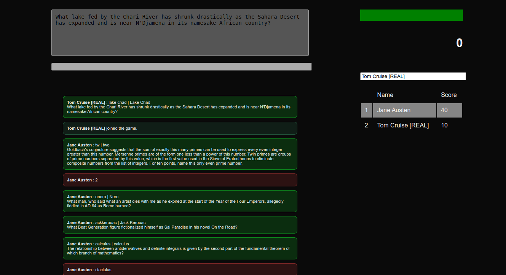

# PBClone

This is a clone of [Protobowl](https://protobowl.com) written in Java.

## Installation

This is not supposed to be installed on a system, it is supposed to be run without touching any
other files or directories. Because of that, you can run `git clone
https://github.com/will-koz/pbclone` to get the entire codebase.

<!-- TODO -->
Currently this feature is unsupported; since this is supposed to be an independent program, a script
can be run to put all of the java code into a single text file and compiled into a .jar file.

## Running

Just run `./run.sh` after `cd`'ing into the cloned repo. If you want to compile it without running,
run `make`, and if you want to run it without recompiling it, run `java Program`.

## License

This is licensed under the [MIT License](license.txt).

## TODO

See the official [TODO list here](doc/TODO.md).

## Credits

- *will-koz*
